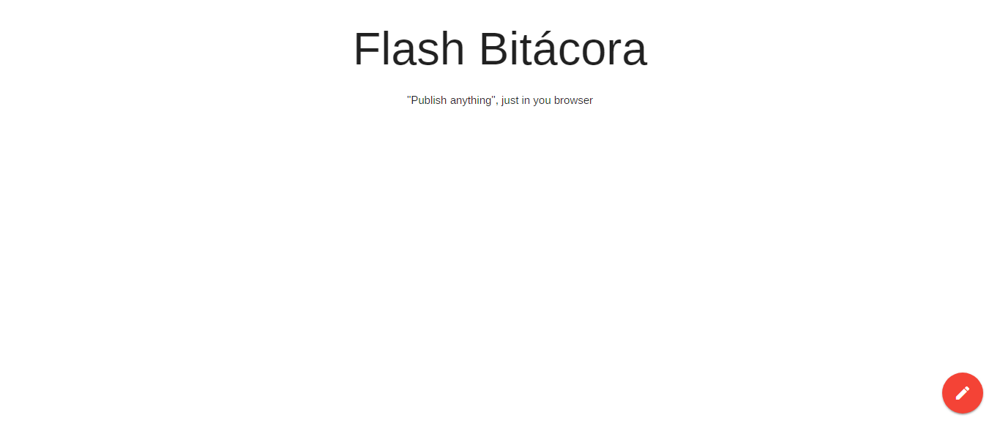
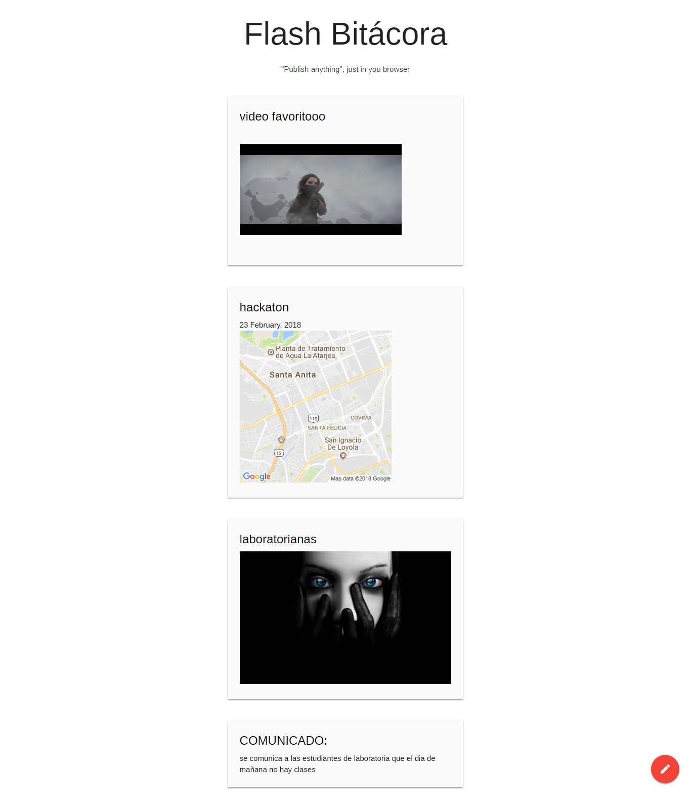

## **FLASH BITACORA**

##  Especificaciones
Vamos a crear una bitácora con la que podrás agregar mensajes, imágenes, audio, video, ubicaciones y fechas. Te sugerimos lo siguiente para llevar a cabo este producto:

Usar Materialize como framework de css
Usar un FAB, Fixed Action Button que tendrá nuestras opciones.
Manejar el DOM, para crear de manera dinámica los elementos que serán agregados a nuestra bitácora

## Planificación

Habiendo que realizar 2 proyectos en parejas, se decidio
avanzar cada una un repositorio hasta la mitad y despues se intercambiaron los proyectos, de esa manera avanzamos  partes iguales, tanto diseño como funcionalidad en ambos proyectos.

Para una comunicacion segura y eficaz se utilizo whatsapp,
una aplicacion de chat para telefonos moviles.

## **DESARROLLO**

Se creo FLASH BITACORA, un espacio donde poder compatir mensajes, fotos, videos, y agendar eventos.

El objetivo a realizar este proyecto es aprender a implementar las nuevas APIs que trae HTML5

## Vistas

##  Tecnologias Usadas
- jquery
- materialize
- javascript
- Html5
- File API
- Geolocation API
- Audio y Vídeo
- Date input

## Autores

- **Claudia Garibotto** - [@Claudiagari](https://github.com/Claudiagari)

- **Wendy Quispe** - [@wendytamara](https://github.com/wendytamara)

## Licencia

Este proyecto está licenciado bajo la Licencia ISC - ver el archivo [LICENSE](https://www.isc.org) para más detalles.

Copyright &copy; 2018 All Rights Reserved.
